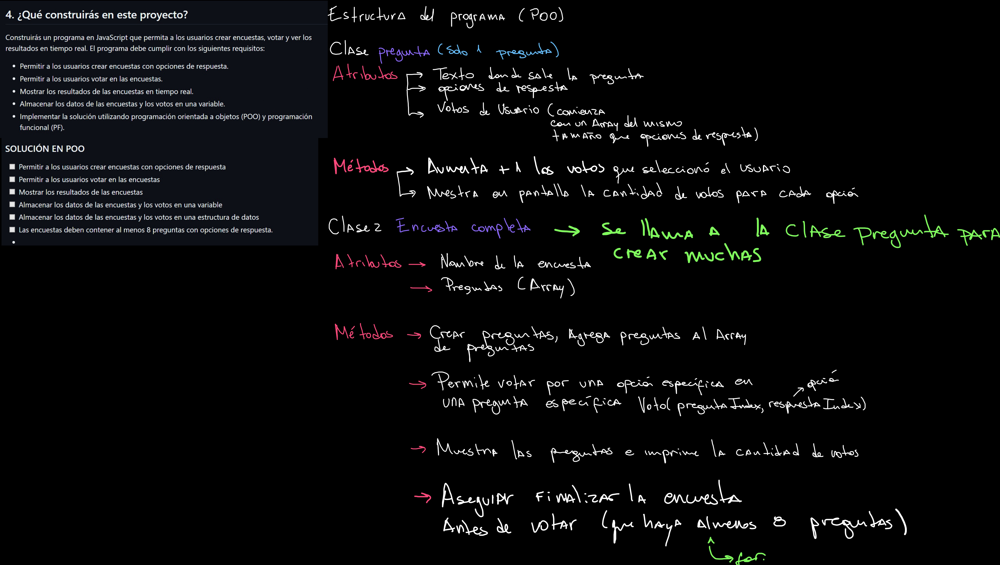
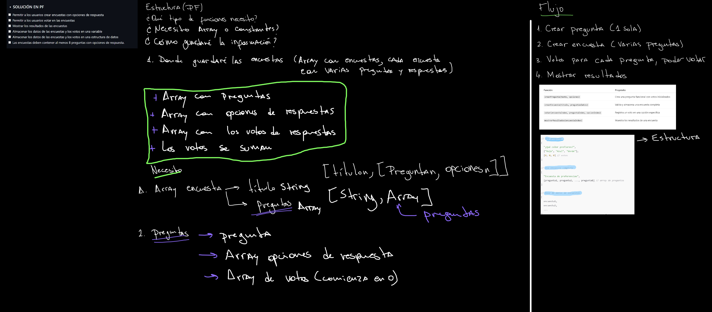

# 🗳️ Proyecto 2: Sistema de Votación en JavaScript

Este proyecto consiste en la creación de un sistema de votación interactivo desarrollado con JavaScript. Permite a los usuarios crear encuestas, votar y visualizar resultados desde la consola del navegador.

---

## 📁 Estructura del Proyecto

El repositorio está organizado en dos enfoques principales de desarrollo:

```text
Proyecto_final/
├── poo/         # Programación Orientada a Objetos
│   ├── index.html
│   └── index.js
│
├── pf/          # Programación Funcional
│   ├── index.html
│   └── index.js
│
└── README.md    # Documentación del proyecto
```
Cada enfoque contiene su propia versión del sistema de votación, respetando los principios y características de su paradigma correspondiente.

---

## ⚙️ Funcionalidades

- Creación de encuestas con al menos 8 preguntas y múltiples opciones de respuesta.
- Registro de votos por opción.
- Visualización de resultados desde la consola del navegador.
- Persistencia de datos en memoria usando estructuras como arrays y objetos.
- Separación clara entre implementación orientada a objetos y funcional.
---
## 🧠 Tecnologías y Herramientas
- JavaScript

- HTML 

- Git y GitHub para control de versiones

## ✅ Cumplimiento de Requisitos
 - Creación y votación de encuestas (mínimo 8 preguntas)

 - Visualización de resultados en consola

- Implementación en POO y PF

 - Separación de carpetas por paradigma

 - Uso correcto de estructuras de datos y funciones

 - Repositorio en GitHub con control de versiones
---
 ## 🗂️ Control de versiones

El control de versiones de este proyecto se trabajó inicialmente desde otro repositorio, donde se realizaron los primeros commits. Posteriormente, el proyecto fue migrado o reorganizado en este repositorio para su entrega final.

Puedes consultar el repositorio original en el siguiente enlace: [Repositorio original](https://github.com/S0uris666/BootcampUDD_Proyectos/tree/main/Modulo_2/Proyecto_Final)

---
## 🤓🧠 Planificación del trabajo

Para organizar y estructurar adecuadamente el desarrollo del proyecto, se elaboró previamente un esquema escrito que permitió visualizar y definir las necesidades y funcionalidades requeridas en ambos enfoques: programación orientada a objetos (POO) y programación funcional (PF). Este esquema sirvió como guía para establecer los pasos a seguir durante la implementación y asegurar que se cumplieran los objetivos de cada paradigma.




